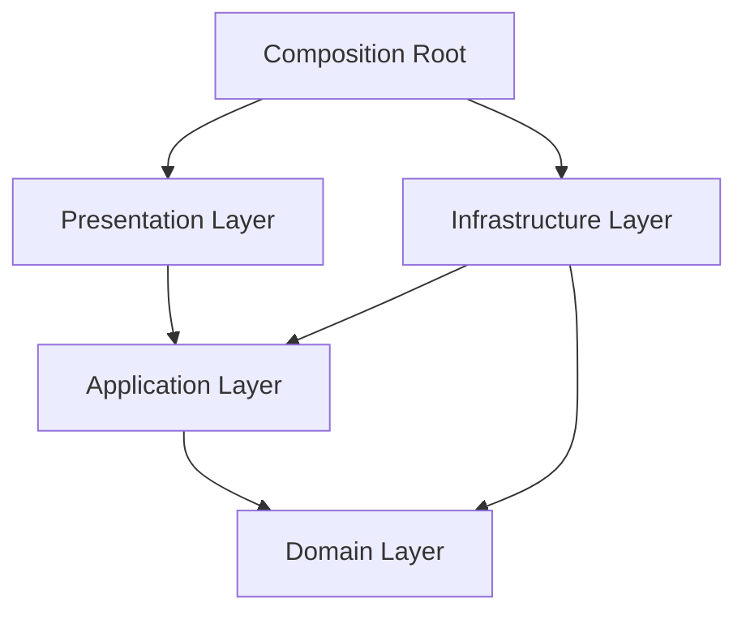
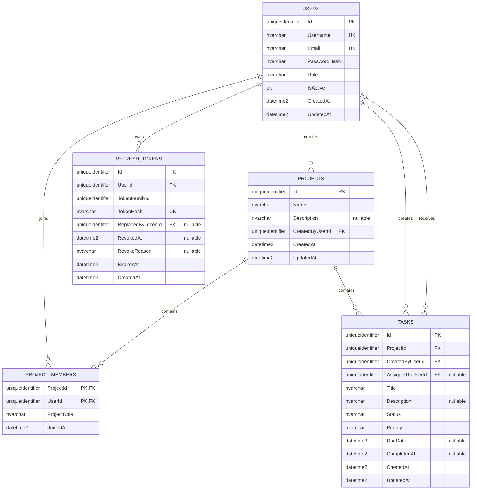
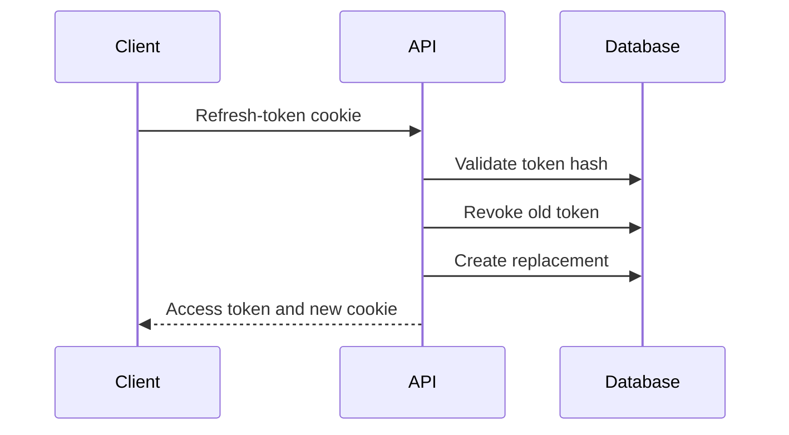

# TaskFlow API

A task and project management REST API built with Express, TypeScript, and Microsoft SQL Server.

TaskFlow provides secure authentication, project membership management, role-based authorization, task workflows, advanced querying, structured error responses, and interactive OpenAPI documentation.

## Features

- JWT access-token authentication
- HTTP-only refresh-token cookies
- Refresh-token rotation and reuse detection
- User registration, login, logout, and logout-all
- User profile and administrator management
- Project and project-member management
- Project-level member and manager roles
- Task creation, assignment, status tracking, and deletion
- Task filtering, date ranges, pagination, and multi-field sorting
- Runtime request validation with Zod
- RFC 7807-style problem responses
- Structured logging with request IDs
- SQL Server migrations
- Swagger UI and OpenAPI documentation

## Technology Stack

| Area               | Technology                   |
| ------------------ | ---------------------------- |
| Runtime            | Node.js 22+                  |
| Language           | TypeScript                   |
| HTTP framework     | Express 5                    |
| Database           | Microsoft SQL Server         |
| Database client    | mssql                        |
| Validation         | Zod                          |
| Authentication     | JSON Web Token               |
| Password hashing   | bcryptjs                     |
| Logging            | Pino and pino-http           |
| API documentation  | OpenAPI 3 and Swagger UI     |
| Development runner | tsx                          |
| Linting            | ESLint and typescript-eslint |

The project uses raw, parameterized T-SQL rather than an ORM.

## Architecture

TaskFlow follows a Clean Architecture-inspired structure. Business rules are separated from HTTP, database, and security implementations.



### Layers

- **Domain:** Entities and repository contracts without framework dependencies.
- **Application:** Use cases, security ports, DTOs, and application services.
- **Infrastructure:** SQL Server repositories, migrations, JWT, bcrypt, refresh-token generation, and logging.
- **Presentation:** Express controllers, routes, middleware, validation, cookies, and OpenAPI documentation.
- **Composition:** Creates concrete implementations and injects them into the application.

## Project Structure

```text
src/
├── app.ts
├── composition-root.ts
├── server.ts
│
├── application/
│   ├── dtos/
│   ├── ports/
│   ├── services/
│   └── use-cases/
│       ├── auth/
│       ├── project-members/
│       ├── projects/
│       ├── tasks/
│       └── users/
│
├── composition/
│   ├── auth-module.ts
│   ├── project-module.ts
│   ├── task-module.ts
│   └── user-module.ts
│
├── config/
│   └── env.ts
│
├── domain/
│   ├── entities/
│   └── repositories/
│
├── infrastructure/
│   ├── database/
│   │   ├── migrations/
│   │   ├── migrate.ts
│   │   ├── migration-runner.ts
│   │   └── sql-server.ts
│   ├── logger/
│   ├── repositories/
│   └── security/
│
├── presentation/
│   └── http/
│       ├── controllers/
│       ├── cookies/
│       ├── middleware/
│       ├── openapi/
│       ├── routes/
│       └── validation/
│
├── shared/
│   └── errors/
│
└── types/
    └── express.d.ts
```

## Database Model

The database uses `UNIQUEIDENTIFIER` primary keys generated with `NEWSEQUENTIALID()`.



The database enforces project membership, task assignment, role, priority, status, and completion rules through foreign keys and check constraints.

## Authentication

Access tokens are short-lived JWTs sent through the Bearer authentication scheme:

```http
Authorization: Bearer <access-token>
```

Refresh tokens are:

- Generated from cryptographically secure random values
- Sent through an HTTP-only cookie
- Stored in the database only as hashes
- Rotated after every successful refresh
- Grouped into token families
- Revoked during logout or suspected reuse



The refresh-token cookie uses `HttpOnly`, `SameSite=Strict`, and `Secure` in production.

## Authorization

TaskFlow supports application-level and project-level roles.

| Role      | Purpose                                         |
| --------- | ----------------------------------------------- |
| `user`    | Standard application user                       |
| `admin`   | Application-wide administrator                  |
| `member`  | Regular project participant                     |
| `manager` | Project participant with management permissions |

Project managers and administrators can manage project membership and delete tasks. Task creators, assignees, managers, and administrators receive permissions according to the requested task operation.

Destructive project deletion requires the requester’s password and is prevented while the project contains tasks.

## Getting Started

### Prerequisites

- Node.js 22 or later
- npm
- Microsoft SQL Server
- Git

SQL Server must accept TCP connections, and the configured database user must have permission to create and modify the application tables.

### 1. Clone the Repository

```bash
git clone https://github.com/emre3657/taskflow-sqlserver-api.git
cd taskflow-sqlserver-api
```

### 2. Install Dependencies

```bash
npm install
```

### 3. Create the Database

```sql
CREATE DATABASE TaskFlowDB;
```

### 4. Configure the Environment

Create `.env` from the example file.

PowerShell:

```powershell
Copy-Item .env.example .env
```

Generate a JWT secret if needed:

```bash
node -e "console.log(require('crypto').randomBytes(64).toString('hex'))"
```

Update `.env` with the generated secret and your SQL Server credentials.

### 5. Run Migrations

```bash
npm run db:migrate
```

Migration files are stored under:

```text
src/infrastructure/database/migrations/
```

Applied migration files should not be modified. Introduce database changes through a new numbered migration.

### 6. Start the Development Server

```bash
npm run dev
```

The API will be available at:

```text
http://localhost:3000
```

### Production Build

```bash
npm run build
npm start
```

## Environment Variables

| Variable                        | Description                       | Example                  |
| ------------------------------- | --------------------------------- | ------------------------ |
| `NODE_ENV`                      | Application environment           | `development`            |
| `PORT`                          | HTTP server port                  | `3000`                   |
| `LOG_LEVEL`                     | Pino log level                    | `debug`                  |
| `DB_SERVER`                     | SQL Server hostname or address    | `127.0.0.1`              |
| `DB_PORT`                       | SQL Server TCP port               | `1433`                   |
| `DB_NAME`                       | Database name                     | `TaskFlowDB`             |
| `DB_USER`                       | SQL Server login                  | `your_database_user`     |
| `DB_PASSWORD`                   | SQL Server password               | `your_database_password` |
| `DB_ENCRYPT`                    | Enable encrypted SQL connections  | `false`                  |
| `DB_TRUST_SERVER_CERTIFICATE`   | Trust the server certificate      | `true`                   |
| `JWT_SECRET`                    | Secret used to sign access tokens | Long random value        |
| `JWT_ACCESS_EXPIRES_IN_SECONDS` | Access-token lifetime             | `900`                    |
| `REFRESH_TOKEN_EXPIRES_IN_DAYS` | Refresh-token lifetime            | `30`                     |
| `BCRYPT_SALT_ROUNDS`            | bcrypt cost factor                | `12`                     |

Never commit `.env` or real credentials.

## Available Scripts

| Command              | Description                                |
| -------------------- | ------------------------------------------ |
| `npm run dev`        | Start the development server in watch mode |
| `npm run build`      | Compile TypeScript into `dist`             |
| `npm start`          | Run the compiled application               |
| `npm run typecheck`  | Check TypeScript without emitting files    |
| `npm run lint`       | Run ESLint                                 |
| `npm run db:migrate` | Apply pending database migrations          |

## API Documentation

Interactive Swagger UI:

```text
http://localhost:3000/api-docs
```

Raw OpenAPI specification:

```text
http://localhost:3000/openapi.json
```

The API includes authentication, user, project, project-member, and task endpoints under the `/api/v1` prefix.

Task listing supports search, multiple filters, date ranges, pagination, and multi-field sorting. Refer to Swagger UI for complete endpoint, request, query, response, and error documentation.

Successful responses use a `data` property. Errors use `application/problem+json` and include a request ID.

## Security Notes

- Passwords are hashed with bcrypt.
- SQL queries use typed parameters.
- Refresh tokens are stored only as hashes.
- Refresh tokens are rotated and tracked by family.
- Request bodies, parameters, and queries are validated with Zod.
- Unexpected errors do not expose stack traces or database details.
- The `X-Powered-By` header is disabled.
- JSON request size is limited.
- User accounts are deactivated rather than physically deleted.

Access tokens are stateless and remain valid until they expire. Deactivation prevents future login and refresh operations.

CORS is not configured because the project currently has no separate browser client. Configure an explicit origin allowlist before connecting a frontend hosted on another origin.

## Logging

Pino provides structured application and HTTP logs with request IDs, status codes, response times, and error details.

## License

This project is licensed under the ISC License.

## Author

Emre Ekinci

Repository: [taskflow-sqlserver-api](https://github.com/emre3657/taskflow-sqlserver-api)
